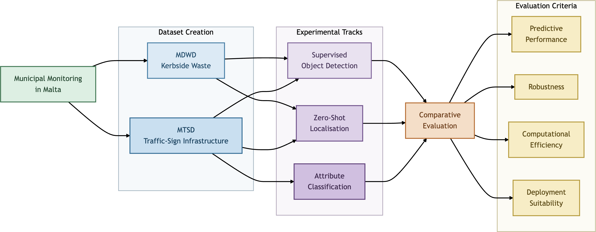

# A Comparative Study of Vision-Based Perception Paradigms for Urban Waste and Infrastructure Monitoring

<p align="center">
  <a href="https://euvip2026.github.io/">
    
  </a>
  <br>
  <sub>
    Paper: <a href="https://arxiv.org/abs/2608.00257"><em>MDWD: A Street-Level Dataset for Municipal Solid Waste Detection in Dense Urban Environments</em></a>
  </sub>
</p>

## Research Overview

This repository contains the research artefacts and implementation accompanying an MSc dissertation which investigated the use of **contemporary computer-vision paradigms for urban monitoring** in Malta. The study focuses on municipal waste detection and traffic-sign assessment, comparing supervised **object detection**, **zero-shot localisation**, and **representation-based classification** across two locally collected datasets.



| Component | Scope |
| --- | --- |
| **MDWDataset** | 3,598 source photographs of domestic waste across five operational waste classes |
| **MTSDataset** | 7,482 street-level photographs containing 20,509 traffic-sign bounding boxes, 12 annotated sign classes, and four maintenance-relevant attributes |
| **Supervised object detection** | YOLO11, YOLO12, YOLO26, and RF-DETR evaluated across multiple model size scales |
| **Zero-shot localisation** | SAM 3, SAM 3.1, LocateAnything-3B, and Cosmos Reason2 2B/8B |
| **Attribute classification** | DINOv3, V-JEPA 2.1, ConvNeXt, and LingBot-Vision evaluated at Base and Large scales using frozen representations, LoRA adaptation, and full fine-tuning for ConvNeXt |

The objective is not solely to identify the highest-performing model, but to examine the trade-offs between **predictive performance, adaptation effort, computational requirements, prompt robustness, and operational usefulness** within local-authority workflows.

## Summary of Results

| Experiment | Best recorded result | Main observation |
| --- | --- | --- |
| **MDWD supervised detection** | **RF-DETR-M:** 78.21% test mAP@50:95 | RF-DETR-M achieved the strongest aggregate result, but exceeded YOLO26-L by only 0.01 percentage points in mAP@50:95. RF-DETR-M provided stronger recall and F1, while YOLO26-L achieved effectively equivalent average precision with fewer parameters and lower computational cost. |
| **MTSD supervised detection** | **YOLO26-M @ 1280:** 77.0% test mAP@50:95 | Input resolution was a major performance driver, with YOLO26 benefiting substantially from increased spatial resolution. At the common 640 × 640 resolution RF-DETR performed more strongly, but high-resolution YOLO26 configurations ultimately achieved the highest overall accuracy. |
| **MTSD attribute classification** | **V-JEPA 2.1-L + LoRA:** 90.06% test mean macro-F1 | LoRA improved all eight matched backbone-scale pairs over frozen probing, with an average gain of 8.68 percentage points. Representation-scale gains were comparatively modest, while physical condition remained substantially more difficult than the structural attributes. |
| **MDWD zero-shot localisation** | **SAM 3:** 56.76% macro-F1 across four class-targeted queries | SAM 3 and SAM 3.1 produced near-identical overall performance and the most balanced retrieval behaviour. Zero-shot performance nevertheless varied substantially between waste classes and was sensitive to how the target concept was expressed. |
| **MTSD zero-shot localisation** | **SAM 3:** 25.74% macro-F1 across the class-targeted and synonym-comparison queries | Zero-shot localisation was considerably more challenging on MTSD, with semantic confusion between visually similar sign classes limiting precision. Cosmos Reason2 8B performed best on several individual classes and showed the greatest overall consistency under prompt reformulation. |

### Additional Findings

- **Strong augmentation** improved MTSD mAP@50:95 in all 12 matched Mild-to-Strong comparisons, with a mean gain of **5.02 percentage points**. This was accompanied by an average **7.08-point increase in recall** and **4.06-point increase in F1**, despite a **2.21-point reduction in precision**.

- Increasing **input resolution** consistently improved MTSD detection across the completed resolution comparisons. YOLO26 continued to benefit substantially up to **1280 × 1280**, while all three RF-DETR scales also improved when evaluated at 640 × 640 relative to their native resolutions.

- **LoRA adaptation** improved mean macro-F1 over frozen probing in all eight matched attribute-classification configurations by **7.67–9.81 percentage points**, averaging **+8.68 points**. By comparison, scaling transformer representations from Base to Large produced considerably smaller gains of **0.67–1.62 points** under LoRA.

- Attribute difficulty was strongly task-dependent. Across all 18 configurations, mean macro-F1 reached **93.60% for geometric shape**, **91.85% for mounting type**, and **89.50% for viewing angle**, compared with only **63.81% for physical condition**.

- Prompt formulation affected both retrieval accuracy and the set of objects returned. This sensitivity was strongly model-dependent: **Cosmos Reason2 8B** produced the most consistent prediction sets under reformulation, while SAM generally achieved stronger aggregate localisation performance.

- Across the three experimental tracks, the most consistent source of failure was a **loss of usable visual detail** rather than general appearance variation. Object scale and scene clutter were the dominant constraints for localisation, while blur particularly affected traffic-sign condition assessment; brightness and contrast showed no consistent effect across the evaluated tasks.

## Datasets for Urban Monitoring

Two locally developed datasets support the dissertation's evaluation across complementary urban-monitoring tasks: the **Maltese Domestic Waste Dataset (MDWD)** for municipal waste detection and the **Maltese Traffic Sign Dataset (MTSD)** for traffic-sign detection and maintenance-oriented attribute assessment.

### Maltese Domestic Waste Dataset (MDWD)

The **MDWD** contains street-level photographs of domestic waste presented for kerbside collection across five operational waste classes used in Malta.

<p align="center">
  <a href="https://universe.roboflow.com/um-dawl-ai-lab/mdwd-maltese-domestic-waste-dataset">
    
  </a>
  <a href="https://universe.roboflow.com/um-dawl-ai-lab/mdwd-maltese-domestic-waste-dataset/model/">
    
  </a>
</p>

**Classes:** `Mixed Waste` · `Organic Waste` · `Recyclable Material` · `Orange CMD` · `Other Waste`

| Property | Value |
| --- | --- |
| **Unique source images** | 3,598 |
| **Working export** | Roboflow v20, 640 × 640 |
| **Exported splits** | 29,487 augmented training / 369 validation / 369 test images |
| **Annotation formats** | YOLO and COCO, derived from the same annotation state |

---

### Maltese Traffic Sign Dataset (MTSD)

The **MTSD** contains street-level smartphone imagery collected across Malta, with each retained traffic sign localised using a bounding box and annotated with a traffic-sign category and four maintenance-relevant attributes.

**Classes:** `Pedestrian Crossing` · `Stop Sign` · `No Entry (One Way)` · `Roundabout Ahead` · `No Through Road (T-Junction)` · `Blind-Spot Mirror (Convex Mirror)` · `Street Sign` · `Directional Sign` · `Tourist Sign` · `Auxiliary Sign` · `Back-Unknown` · `Other-Unknown`

**Attributes:** `Viewing Angle` · `Mounting` · `Physical Condition` · `Sign Shape`

| Property | Value |
| --- | --- |
| **Source images** | 7,482 |
| **Annotated instances** | 20,509 |
| **Detection classes** | 12 annotated classes; 11 retained in the main analysis |
| **Attributes** | Viewing angle, mounting, physical condition, and sign shape |
| **Canonical split** | 5,986 training / 749 validation / 747 test source images |
| **Attribute study** | 19,253 retained sign crops |

## Reproducibility

The repository is structured to support reproducible experimentation across all three research tracks.

- A fixed random seed of **42** is used throughout.
- Dataset splits are assigned at source-image level to prevent data leakage.
- Experimental configurations, environments, and evaluation outputs are retained alongside each run.
- Prepared datasets and annotation exports are accompanied by **SHA-256 manifests**.

The repository preserves the code, configurations, evaluation artefacts, and supporting documentation required to reproduce the reported experiments.

## Getting Started

Clone the repository and install the environment required for the workflow you want to reproduce. Environment definitions and setup instructions are available in [`Requirements/CondaEnvironments/`](Requirements/CondaEnvironments/README.md).

### Environments

| Environment | Primary use |
| --- | --- |
| `MDWD` | YOLO/RF-DETR training and MDWD analysis |
| `mtsd-attrcls` | Multi-head MTSD attribute classification |
| `mtsd-base` | MTSD detection, SAM/Cosmos evaluation, QA, and privacy tooling |
| `mtsd-la` | LocateAnything evaluation |

### Weights & Biases

Optional [Weights & Biases](https://wandb.ai/) logging can be configured through a Git-ignored root `.env` file:

```dotenv
WANDB_MODE=online
WANDB_API_KEY=<your-key>
WANDB_ENTITY=<your-entity>
```

### Interactive Launcher

Repository workflows can be accessed through the interactive launcher:

```bash
python launch_uvb.py
```

The launcher selects the required Conda environment and provides access to the associated training, evaluation, analysis, and utility workflows.

## Data Availability, Ethics, and Privacy

Raw street-level imagery is **not publicly distributed** because the source images may contain:

- identifiable faces;
- vehicle registration plates;
- location metadata; and
- other potentially personal information.

Access to the raw data is restricted and governed by the dissertation's GDPR-aware data-handling procedure.

Any imagery selected for publication must pass the repository's face, registration-plate, and QR-code redaction workflow, including manual preview and verification.

The public research artefact therefore provides the **implementation, annotation schema, experimental configurations, provenance records, and numerical evidence** required to inspect the study without exposing the underlying personal data.

GPS information is used only for aggregate reporting.


## Citations

If you use this repository, its datasets, or its methodology, please cite the relevant work.

```bibtex
@inproceedings{MDWD-ResearchPaper,
  author    = {Lucas, Andrea Filiberto and Bugeja, Mark and Debono, Carl James and Seychell, Dylan},
  title     = {MDWD: A Street-Level Dataset for Municipal Solid Waste Detection in Dense Urban Environments},
  booktitle = {2026 14th European Workshop on Visual Information Processing (EUVIP)},
  year      = {2026}
}

@dataset{MDWDataset,
  title     = {Maltese Domestic Waste Dataset (MDWD)},
  author    = {Lucas, Andrea Filiberto and Seychell, Dylan and Bugeja, Mark},
  year      = {2026},
  type      = {Open Source Dataset},
  publisher = {Roboflow},
  url       = {https://universe.roboflow.com/um-dawl-ai-lab/mdwd-maltese-domestic-waste-dataset}
}

@mastersthesis{lucas2026-UVBDissertation,
  title  = {A Comparative Study of Vision-Based Perception Paradigms for Urban Waste and Infrastructure Monitoring},
  author = {Lucas, Andrea Filiberto},
  year   = {2026},
  school = {University of Malta},
  type   = {MSc Dissertation}
}
```

## License

This project is licensed under the **CC BY 4.0 License**. See the [`LICENSE`](LICENSE) file for details.


## Acknowledgements

This project was developed as part of the `ICS5200 - Dissertation` study unit at the **University of Malta** and submitted in partial fulfilment of the requirements for the **MSc in Artificial Intelligence**.

The dissertation was supervised by **Dr Dylan Seychell**, with **Dr Mark Bugeja** serving as co-supervisor.

This research was supported by the [Pathfinder Digital Scholarship](https://mdia.gov.mt/services/pathfinder-digital-scholarship/), awarded by the [Malta Digital Innovation Authority (MDIA)](https://mdia.gov.mt/) under the **2025 call**.

The research was also closely motivated by the practical requirements of the **Application of AI and Computer Vision to Optimise Cleansing Operations in Malta (AICOM)** project. Key components of the dissertation, including the development of the **MDWD**, directly support the project's objectives and operational requirements.

AICOM was funded by the Government of Malta's [Cleansing and Maintenance Division (CMD)](https://publiccleanliness.gov.mt/public-bodies/cmd/).

This work was conducted within the [Dawl AI Lab](https://www.um.edu.mt/research/dawl/) at the University of Malta's Department of Artificial Intelligence.

## Contact

For questions or feedback, please contact [Andrea Filiberto Lucas](mailto:contact@aflucas.com).

---
